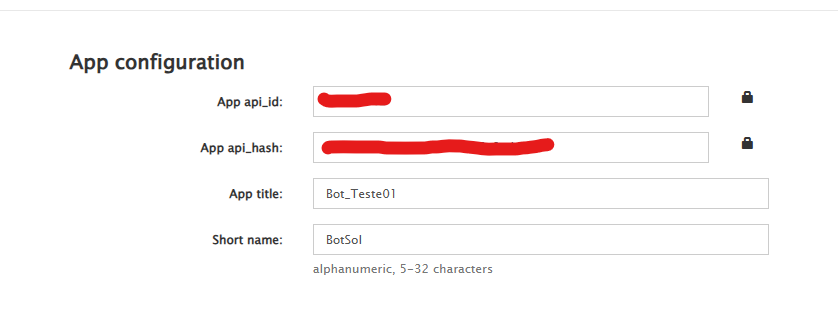

# Telegram Solana Address Monitor

Este é um bot do Telegram que monitora mensagens em grupos específicos, identifica endereços da blockchain Solana e os encaminha para um grupo de destino, no caso, o Trojan para fazer autobuy.


# 🚀 Funcionalidades

* Monitora múltiplos grupos do Telegram.

* Captura endereços da Solana usando regex.

* Evita mensagens duplicadas usando cache.

* Encaminha quase que instantaneamente por usar a API do Telegram.

* Exibe logs para monitoramento.

# 🛠 Configuração

## 1. Pré-requisitos

Certifique-se de ter o Python instalado (3.8 ou superior) e instale as dependências necessárias:
```bash
pip install -r requirements.txt
```

## 2. Configurar API do Telegram

Primeiro obtenha um Api_id E Um api_hash em https://my.telegram.org/auth

 


📌 Apos isso isira os dados da sua api no codigo de Id_chats.py

 

📌 Apos isso execute o codigo de ID_chats.py, quando rodar o codigo o telegram ira pedir seu numero
insira o numero completo(ex:+5511993046677), apos isso ele ira um codigo de confirmacao
para seu telegram, ai e so colar o codigo no terminal


📌 Apos isso o codigo ira te retornar todos os ids dos grupos e chats que tem na sua conta

 

📌Salve o id do trojan ou seu bot de preferencia , e tambem dos grupos que voce quer pegar o
CA.
Apos isso insira esse ids no codigo principal autobuy.py, tambem isira os dados da sua api
do telegram


📌 Apos isso e so rodar o codigo principal e ja esta funcionando

Video do bot funcionando

[](https://www.youtube.com/watch?v=WeuUu87piY8)


▶️ Como Executar
Após configurar, inicie o bot com:
```bash
python bot.py
```

O terminal exibirá logs indicando que o bot está ativo:

[🚀] Bot iniciado e monitorando múltiplos grupos...

📜 Licença
Este projeto é de código aberto e pode ser modificado livremente.


